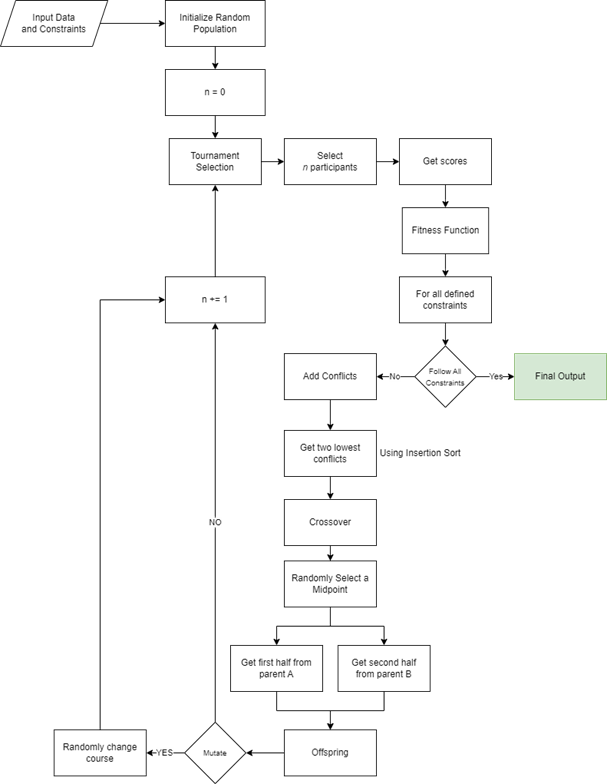
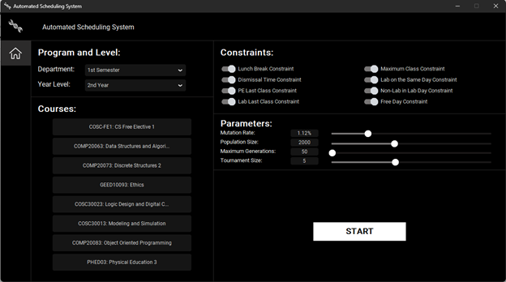
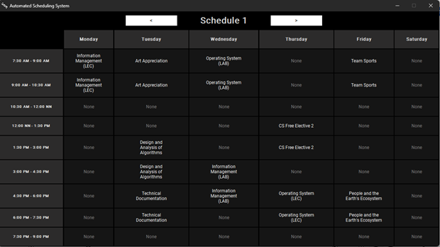

<h1 align='center'><b>Automated Scheduling System</b></h1>
<h3 align='center'>A Desktop Application Project for the course COSC 30033 - Design and Analysis of Algorithms from Polytechnic University of the Philippines.</h3>

### Overview

This project was made as an attempt to solve the weekly university class scheduling problem, considered as an NP problem, using __genetic algorithm__.

### Genetic Algorithm

A genetic algorithm (GA) is a powerful problem-solving programming technique. It is in a category of evolutionary algorithms which is a subset of evolutionary computation. It was developed in 1960 by Professor John Holland of the University of Michigan. His book, Adaptation in Natural and Artificial Systems pioneered genetic algorithm (GA) research in the 1970s. This technique was inspired by the Darwinian theory of natural evolution, which states that the organisms in the world multiply in geometric proportions leading to a struggle for existence due mainly to limited space and food. In this struggle the fittest will survive. The fittest are those with favorable variations, the accumulation of which lead to the evolution of species. The chances for the survival of organisms with injurious variations are rather slim. Thus, evolution is a process of natural selection.

### System Architecture

### User Interface

#### Landing Screen

#### Home

### Results

### Disclaimer

This repository only serves as a container for the web application's source code. This is not intended for a local machine deployment or execution.

### Contributors

This project was made by John Kenneth Velano, John Paulo Dela Cruz, Jeremy Jhay Cayabyab, and Jay-R Magtangob.